# Mancala

Multiplayer Mancala game developed in C# Windows Forms App that uses MySQL
This project is a collaboration between [adriandborsan](https://github.com/adriandborsan) and [Danniel1220](https://github.com/Danniel1220).

## Table of Contents

- [Mancala](#mancala)
  - [Table of Contents](#table-of-contents)
  - [Protocol Description and Operation](#protocol-description-and-operation)
  - [Detailed Description of Protocol Primitives](#detailed-description-of-protocol-primitives)
  - [User Manual](#user-manual)
  - [Game Rules](#game-rules)
  - [User Manual for Game](#user-manual-for-game)
  - [Getting started](#getting-started)

---

## Protocol Description and Operation

## Detailed Description of Protocol Primitives

The DASP (Daniel Adrian SPRC(Computer Networks Software Systems/Sisteme de Programe pentru Rețele de Calculatoare) Protocol) is a protocol built over TCP/IP protocols. It's based on the following format of a request: `/dasp[x][y]{command: a}{body}` where:

- `x`: number of bytes of the JSON header
- `y`: number of bytes of the JSON body request
- `a`: the command that was given
- `body`: the request body, which varies according to the command given

This protocol doesn't use an end-of-request delimiter since we know the exact size of the request.

The primitives of this protocol are:

- SUCCESS
- ERROR
- REGISTER
- LOGIN
- ROOMS_UPDATED
- CREATE_ROOM
- JOIN_ROOM
- LEAVE_ROOM
- SEND_PRIVATE_MESSAGE
- SEND_PUBLIC_MESSAGE
- CHAT_UPDATED
- PLAYERS_UPDATED
- GAME_STATE_UPDATED
- GAME_STARTED
- GAME_FINISHED

---

## User Manual

The project is composed of 3 projects: `client`, `server` and `dasp`. `dasp` contains the networking logic, while the other 2 projects can be run.

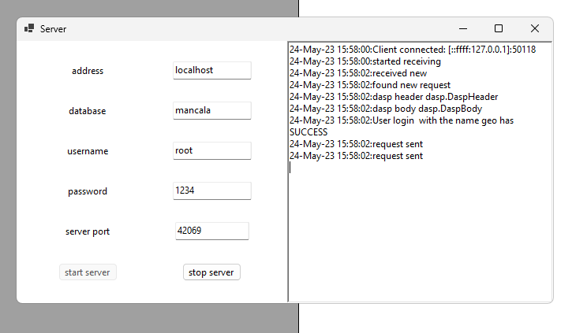

The server window contains fields for database connection and the port on which the server will run. It also contains buttons for starting and stopping the server, which are accessible depending on whether the server is closed or open. On the right side of the window, you can monitor the server status and messages will appear for new connections, when someone enters a game room, etc.

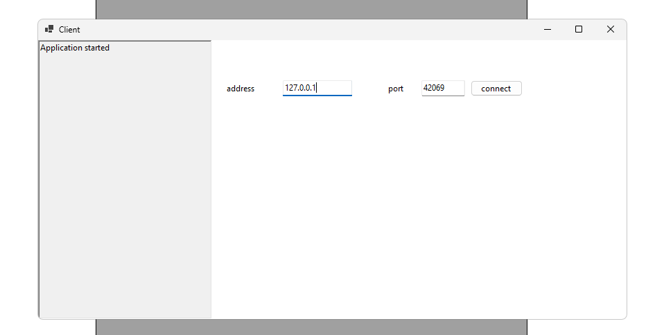

The client opens at the connection window where the server address and port can be set.

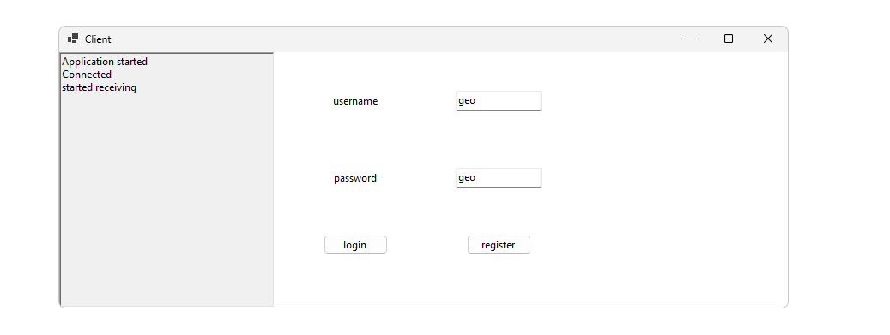

In case of a successful connection, the user will be redirected to the login window where they can create a new account or login with an existing one.

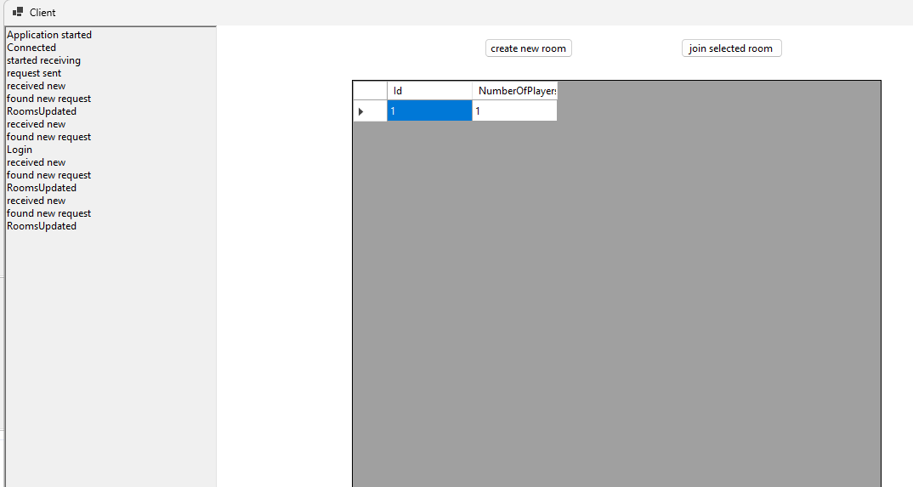

Upon successful login, the player will be redirected to the room list where they can create a new room or join an existing one by pressing the triangle to the left of the room id.

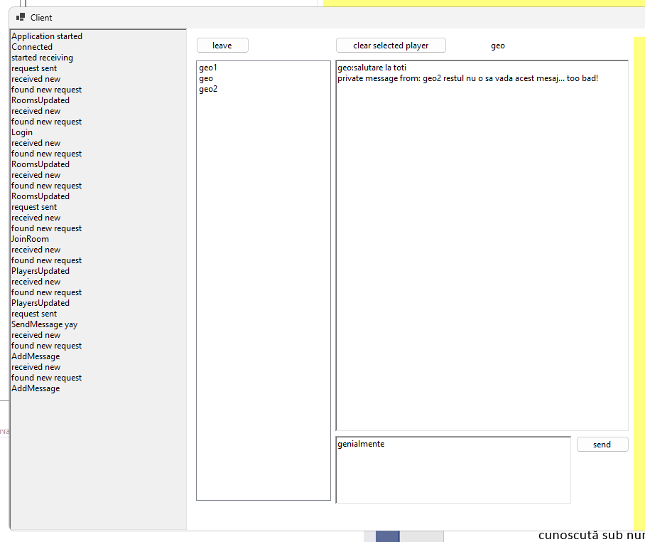

Once in a room, the chat can be used by writing a message in the box below and pressing the send button. If a player is selected from the list on the left, then instead of a public message, a private message will be sent to the selected person.

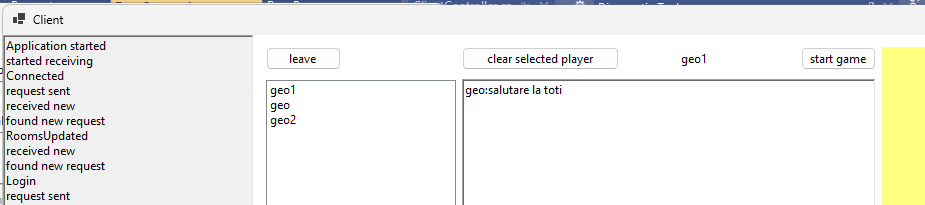

The room owner also has access to a game start button where they can start a new game.

---

## Game Rules

**Mancala** is a strategic game with two rows of holes and stones that are moved around these holes. There are many variants of the game, but I will explain here the general rules for the version known as Kalah, which is the most popular.

---

## User Manual for Game

When both Mancala match players are ready, player 1 can press the "Start Game" button to start the game.

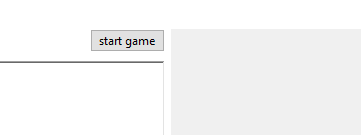

Both players automatically receive their 24 stones (4 in each hole) and player 1 can make the first move.

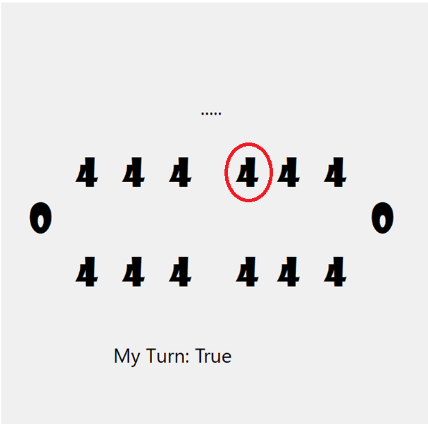

By pressing on one of the numbers (which represent each hole and the number of stones in that hole), we can make a move. Selecting the hole circled in red, we reach the following situation:

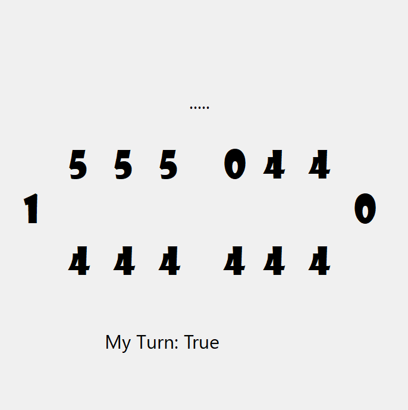

In which the last stone was placed in the left-hand Kalah of player 1, thus receiving an extra turn. The game progresses alternatively, following the rules mentioned above:

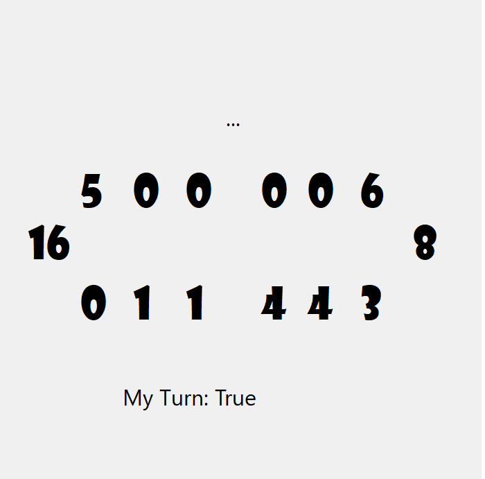

In case a player tries to make a move when it's not their turn, a temporary message appears on the screen informing them it's not their turn.

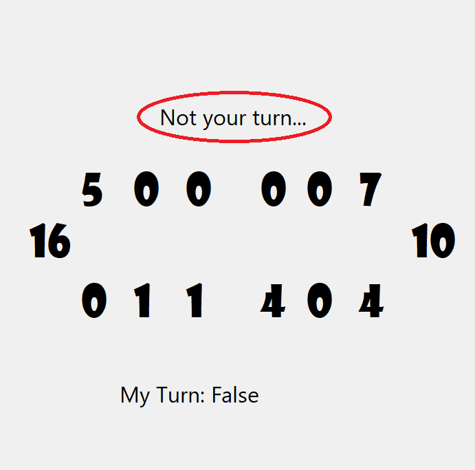

When one of the players no longer has a valid move to make (no stones left in any of their pockets), the game ends and each player is informed about the match result (win, loss, or tie).

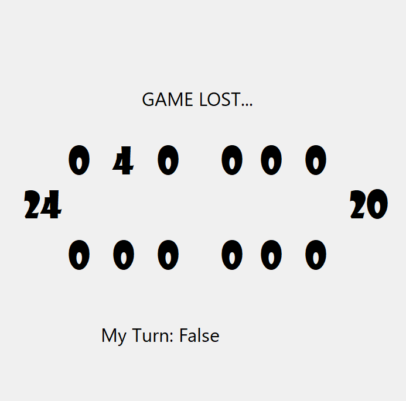

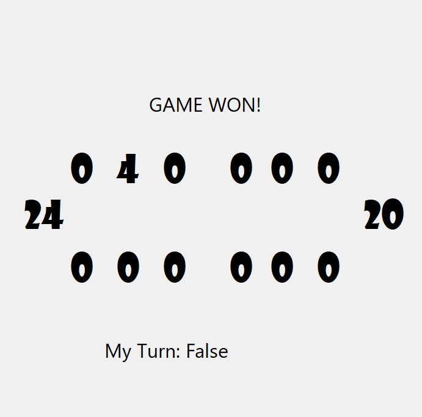

---

## Getting started

For testing purposes, the project can be set up in visual studio to have multiple startup and setting both dasp server and dasp client to start. before running the mysql model needs to be forward engineered
